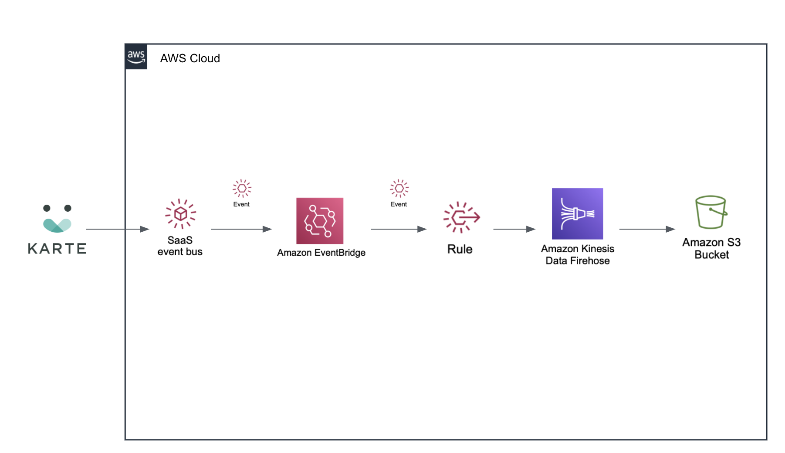

# eventbridge-integration-plaid-karte-s3
## Amazon EventBridge Integration Solution: Store end-user data in S3 in near real-time 

This Quick Start deploys an integration with Amazon S3 and Amazon Kinesis for Amazon EventBridge SaaS Partner Integrations with PLAID. 
The solution leverages KARTE's customer service actions to send any end-user's data to the Amazon EventBridge event bus and store the data in S3 via Kinesis firehose when the events are matched.

By using Amazon Kinesis Firehose, we can also store the data in S3 in near real-time and low-code. This makes it possible to use end-user data in your own analysis environment, such as Amazon Redshift or Athena.

To post feedback, submit feature ideas, or report bugs, use the Issues section of [this GitHub repo](https://github.com/aws-quickstart/eventbridge-integration-plaid-karte-s3-integration).

