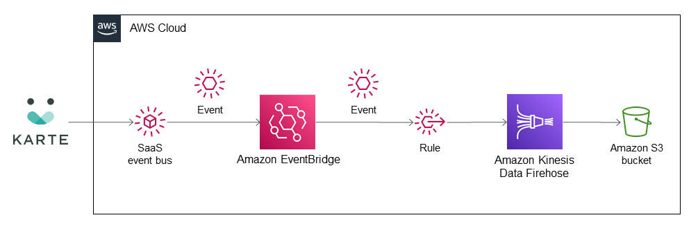

# eventbridge-integration-plaid-karte-s3
## Amazon EventBridge Integration for PLAID KARTE S3

This Quick Start integration combines Amazon Simple Storage Service (Amazon S3), Amazon Kinesis Data Firehose, and Amazon EventBridge from Amazon Web Services (AWS) with PLAID KARTE, a software-as-a-service (SaaS) product.

This integration sends KARTE events to Amazon S3 through the KARTE administration page. KARTE events can contain various metadata, such as user ID, visited pages, purchase amounts, campaigns users participate in, and data defined by KARTE users.

You can use the data stored in Amazon S3 to improve your system's flexibility and visibility. By changing the data destination in Kinesis Data Firehose, you can deliver KARTE data not only to S3 but also to other services, such as Amazon Redshift, Amazon OpenSearch Service (successor to Amazon Elasticsearch Service), and SaaS providers, such as Datadog and MongoDB Atlas.

To post feedback, submit feature ideas, or report bugs, use the **Issues** section of [this GitHub repo](https://github.com/aws-quickstart/eventbridge-integration-plaid-karte-s3-integration).
